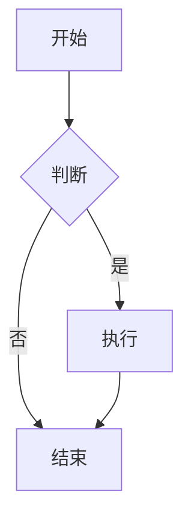
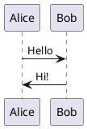

## 关于本博客

本博客基于 [Astro](https://astro.build/) 构建，使用 [Firefly](https://github.com/CuteLeaf/Firefly) 主题。支持 Markdown 和 MDX 两种文章格式，一般情况下 Markdown 就足够使用了。

## 文章 Front-matter

每篇文章以 YAML front-matter 开头，配置标题、日期、标签等信息：

```yaml
---
title: 文章标题
published: 2025-06-01
description: 文章描述
tags: [标签1, 标签2]
category: 分类
image: ./cover.jpg
draft: false
---
```

- `draft: true` 时文章不会显示在公开页面，适合草稿阶段
- `pinned: true` 可将文章置顶

## Markdown 基础语法

### 标题

使用 `#` 号标记标题层级，从 `#`（一级）到 `######`（六级）。

### 文字样式

**粗体**、*斜体*、~~删除线~~、`行内代码`

### 链接与图片

```markdown
[链接文字](https://example.com)

```

### 列表

无序列表用 `-` 或 `*`，有序列表用数字加点：

```markdown
- 项目一
- 项目二

1. 第一步
2. 第二步
```

### 引用

> 这是一段引用文字
> 可以多行

### 表格

| 列一 | 列二 | 列三 |
|------|------|------|
| 内容 | 内容 | 内容 |

### 分割线

使用 `---` 创建分割线。

---

## 代码块

使用三个反引号包裹代码，支持语法高亮：

```python
def hello():
    print("Hello, World!")
```

```typescript
const greeting: string = "Hello, TypeScript!";
```

本博客使用 [Expressive Code](https://expressive-code.com/) 渲染代码块，支持行号、高亮、差异标记等高级功能。

## 数学公式（KaTeX）

### 行内公式

欧拉公式 $e^{i\pi} + 1 = 0$，质能方程 $E = mc^2$

### 块级公式

$$
\int_{-\infty}^{\infty} e^{-x^2} dx = \sqrt{\pi}
$$

$$
x = \frac{-b \pm \sqrt{b^2 - 4ac}}{2a}
$$

## 图表

### Mermaid

支持流程图、时序图、甘特图等：



### PlantUML

支持时序图、类图、用例图等：



## 提醒框

Firefly 支持多种风格的提醒框：

> [!NOTE]
> 这是一个普通提示框。

> [!TIP]
> 这是一个小贴士。

> [!WARNING]
> 这是一个警告。

> [!IMPORTANT]
> 这是重要提示。

## GitHub 仓库卡片

使用 `::github` 指令嵌入仓库卡片：

::github{repo="CuteLeaf/Firefly"}

## 嵌入视频

直接从 YouTube 或其他平台复制嵌入代码，粘贴到文章中即可。

## MDX 支持

如果需要更复杂的内容（如组件），可以使用 `.mdx` 格式：

```mdx
---
title: MDX 文章
---
import { Icon } from 'astro-icon/components'

<Icon name="fa7-brands:github" />
```

## 文章加密

在 front-matter 中设置 `password` 字段即可加密文章，读者需要输入密码才能查看：

```yaml
---
password: "123456"
passwordHint: "提示文字"
---
```

## 布局系统

Firefly 提供灵活的布局配置：
- **侧边栏布局**：左侧栏、右侧栏、双侧边栏
- **文章列表布局**：列表模式、网格模式、混合模式
- 可在页面右上角的设置面板中切换

---

更多详细内容请参考 [Firefly 官方文档](https://docs-firefly.cuteleaf.cn/)。
